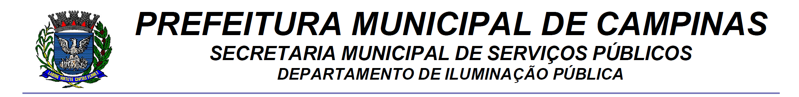

```{r setup, include=FALSE}
knitr::opts_chunk$set(echo = FALSE, message = FALSE, warning = FALSE)
#install.packages("tidyverse")
#install.packages("kableExtra")
#install.packages("knitr")
#install.packages("googlesheets4")
#install.packages("zoo")
#install.packages("tinytex")
#tinytex::install_tinytex(force = TRUE)
library(aws.s3)
library(tidyverse)
library(janitor)
library(kableExtra)
library(knitr)
#library(googledrive)
library(googlesheets4)
library(zoo)

```

```{r,eval=F, echo=F, out.width="100%"}

#  - \usepackage{float}
#  - \floatplacement{figure}{H}
```

\addtolength{\headheight}{2.5cm} 
\fancypagestyle{plain}{} 
\pagestyle{fancy} 
\fancyhead[C]{\includegraphics[width = 480pt]{logo.png}}
\renewcommand{\headrulewidth}{0pt} 


```{r,message=FALSE,warning=FALSE,echo=FALSE}

`%!in%` <- Negate(`%in%`) 

# P_MONI
p_moni <-   s3read_using(FUN = arrow::read_parquet,
               object = "tt_painel_monitoramento.parquet",
               bucket = "automacao-conecta"
  ) %>%
  filter(tipo_de_ocorrencia %in% c(
    "Lâmp. acesa durante dia\t",
    "L\u00e2mp. acesa durante dia\t",
    "Lâmp. apagada",
    "L\u00e2mp. apagada",
    "Lâmp. Acende e Apaga\t",
    "L\u00e2mp. Acende e Apaga\t",
    "Manutenção Troca de Led",
    "Manutenção Troca de Led",
    "Ronda - Lampada Apagada",
    "Ronda - Lampada Acesa",
    "Ronda Led Apagada",
    "Ronda Luminaria LED apagada",
    "Ronda LED aceso",
    "Ronda LED acende e apaga",
    "Ronda - Lampada Apagada"
    "L<U+00E2>mp. apagada"
    "Ronda - Lampada Apagada" 
    "Ronda Luminaria LED apagada"
    "Manuten<U+00E7><U+00E3>o Troca de Led"
    "L<U+00E2>mp. Acende e Apaga\t"
    "Ronda - Lampada Acesa"


)) %>% 
  select(Protocolo = protocolo,Rua = endereco, Bairro = bairro) %>% 
  filter(!is.na(Rua),!is.na(Bairro)) 


# OBRAS
obras <- s3read_using(FUN = arrow::read_parquet,
                      object = "tt_obras.parquet",
                      bucket = "automacao-conecta") 
# AUTH
#gs4_auth(path = "service_account.json")
#gs4_deauth()
suppressMessages(gs4_deauth())

# URL
url <- "https://docs.google.com/spreadsheets/d/1-aZzIFBEa91UAz1_D6PtI-nyl-fDmTqrLiBv_F2fiBI/edit?gid=1623874226#gid=1623874226"

#gs4_auth(path = "credenciais_gmail_api.json")

# GET SHEET
sheet_prog <- suppressMessages(gs4_get(url)) 

# DADOS SHEET
dados_sheet <- suppressMessages(read_sheet(sheet_prog,sheet = "Prog")) %>% 
  filter(rowSums(is.na(.)) != ncol(.)) %>% 
  zoo::na.locf() %>% 
  mutate(Data = as.Date(Data))

# CONDIÇÃO - ATUALIZADO NA DATA
condicao <- Sys.Date() %in% unique(dados_sheet$Data)

if(condicao == T){
  tab_programacao <- dados_sheet %>% 
    filter(Data == Sys.Date()) %>% 
    select(Projeto) %>% 
    distinct() %>% 
    left_join(obras %>% 
                select(Projeto = id_projeto,Rua = rua,Bairro = bairro),
              by = "Projeto") %>% 
    filter(!is.na(Rua)) 
} else {
  cat()
}


```


```{R results = "asis", echo=F,message=FALSE,warning=FALSE}
if(condicao == T){cat("## **RELATÓRIO DIARIO MANUTENÇÃO/MODERNIZAÇÃO**","\n","\n")} else{cat()}

if(condicao == T){cat("## **Modernização**",format(Sys.Date(),'%d/%m/%Y'),"(Suscetível a mudanças ao decorrer do turno)","\n")} else{cat()}

if(condicao == T){
kbl(tab_programacao,longtable = T,align = "c",escape = T) %>% 
  kable_styling(latex_options = c("scale_down","HOLD_position","repeat_header")) %>% 
    row_spec(0, bold = T, background = "#D3D3D3", color = "black")
  
} else {cat()}

```


```{r, echo=F,message=FALSE,warning=FALSE}
kbl(p_moni,longtable = T,align = "c",escape = T) %>% 
  kable_styling(full_width = F,latex_options = c("scale_down","HOLD_position","repeat_header")) %>% 
  column_spec(1, width = "3cm") %>% 
  column_spec(2, width = "6cm") %>% 
  row_spec(0, bold = T, background = "#D3D3D3", color = "black")
```
